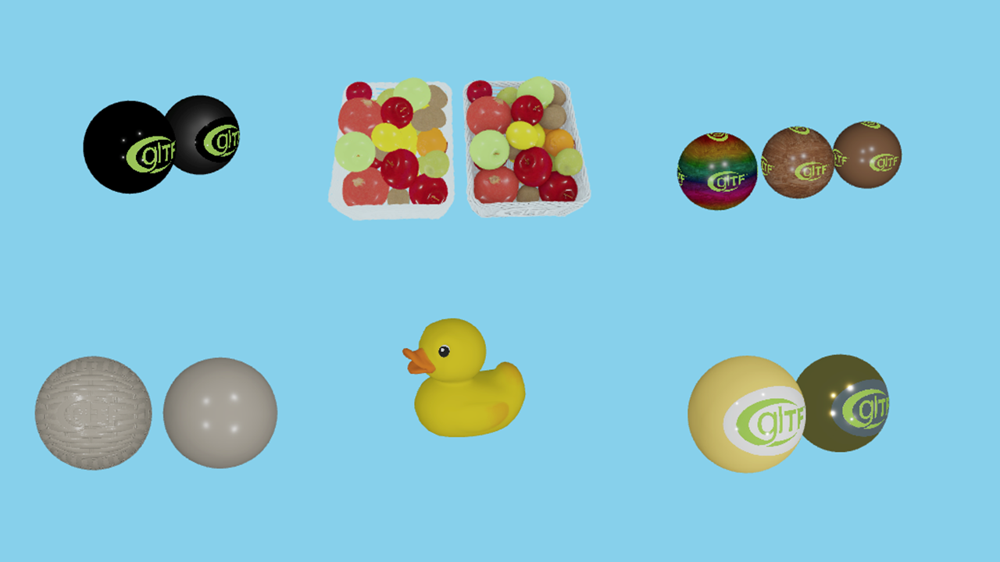
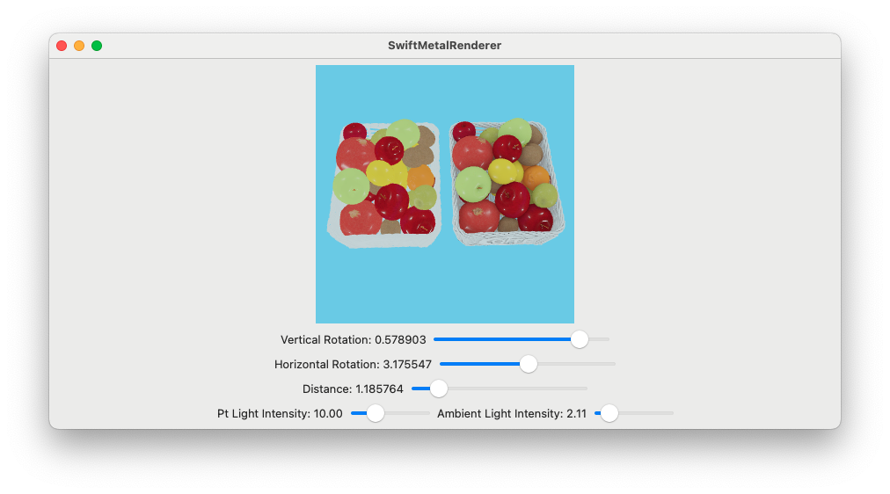

# Swift Metal Renderer (iOS, macOS)
This is a Apple Metal practice project written in Swift. It uses custom YAML to composite scene and uses GLTF as model/material as assets.

## Current Features
* GLTF PBR, Ambient Occlusion, Normal Map
* Tile-based deferred rendering 4xMSAA
* Works on macOS and real iPhone